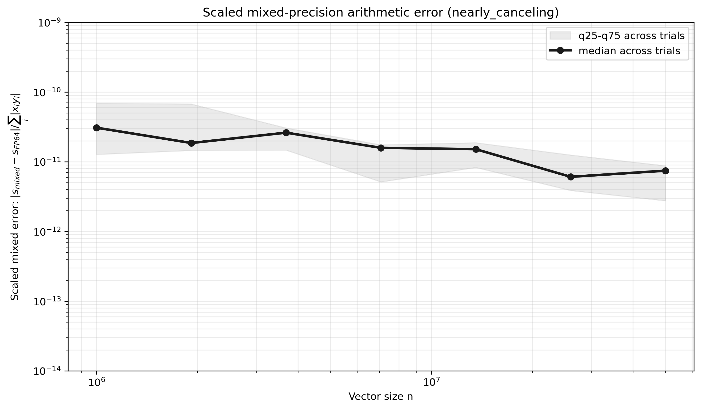
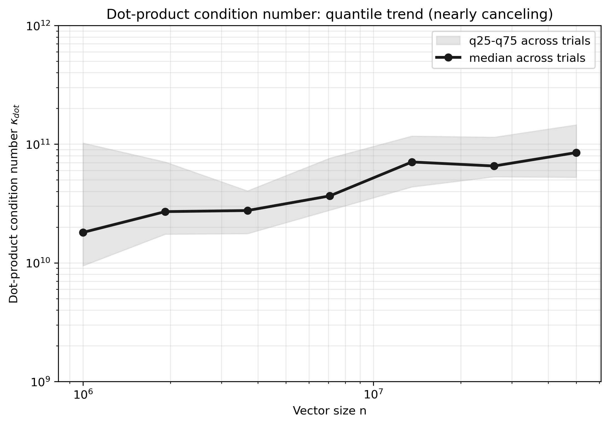

# Mixed-Precision QR and Floating-Point Error Analysis

Research code for studying how floating-point precision, accumulation strategy,
algorithmic structure, and parallel reduction affect the accuracy and performance
of inner products and QR factorization.

This repository grew from my MSc dissertation at Durham University,
*Error Analysis of Floating-Point Algorithms to Compute Inner Products and the
QR Factorization, with an Application to Least Squares Problems*. It now also
includes configurable mixed-precision kernels and a C++/OpenMP dot-product
benchmark.

## Research questions

- How do rounding errors grow with vector or matrix size?
- When does higher-precision accumulation improve a low-precision product?
- How do Householder, compact WY-style, and blocked QR compare in finite precision?
- How does OpenMP reduction order affect reproducibility and numerical error?
- When does cancellation make relative error misleading?

## What is implemented

| Component | Implementations | Main outputs |
| --- | --- | --- |
| Python inner products | FP32, FP64, configurable low-product/high-accumulation, and an experimental rounded-input FP64-FMA model | Error versus vector length |
| Python QR | Householder, compact WY-style, blocked QR, and Householder QR with explicit mixed-precision dot products | Reconstruction, orthogonality, and least-squares errors |
| C++17/OpenMP dot products | Serial and parallel FP64; serial and parallel FP32-product/FP64-accumulation | Runtime, speedup, mixed-arithmetic error, and reduction-order error |
| Input stress tests | Normal, positive uniform, alternating sign, ill-scaled, and nearly canceling vectors | Error distributions and dot-product condition estimates |

The Python implementations favor transparent arithmetic over speed. The C++
module is used for performance and OpenMP reduction experiments.

## Mixed-precision arithmetic model

The main mixed dot product explicitly computes

```text
x_low    = round_to_fp32(x[i])
y_low    = round_to_fp32(y[i])
prod_low = round_to_fp32(x_low * y_low)
sum      = round_to_fp64(sum + prod_low)
```

Thus, the default model is **FP32 operands + FP32 products + FP64
accumulation**. The product is rounded before accumulation, so this is **not** a
fused multiply-add model. An alternative rounded-input FP64-FMA experiment is
kept separate in `src/mixed_kernels.py`.

## Error metrics

The QR experiments report:

- **Reconstruction:** $\|A-QR\|_F / \|A\|_F$
- **Orthogonality:** $\|Q^TQ-I\|_F / \|Q\|_F$
- **Least-squares residual:** $\|Rx-Q^Tb\|_2 / \|b\|_2$

The C++ experiments distinguish:

- `mixed_error_vs_fp64`: the effect of the mixed arithmetic model relative to
  serial FP64;
- `parallel_error_vs_serial_same_precision`: the effect of OpenMP reduction
  order within the same precision model; and
- $\kappa_{dot}=\sum_i |x_i y_i|/|x^Ty|$: a cancellation-sensitive condition
  estimate for the dot product.

## Representative results

Across the recorded sweep, mixed relative errors for normal, alternating-sign,
and ill-scaled inputs were typically on the order of $10^{-8}$ to $10^{-7}$.
Positive inputs were substantially less sensitive because their products do not
cancel. For nearly canceling inputs, the computed dot product can be close to
zero, so relative error may become order one even when the scaled absolute error
remains small. The condition estimate is therefore essential for interpreting
these cases.

<p align="center">
  
  
</p>

Additional figures, raw observations, and summary tables are available in
[`cpp_hpc/results`](cpp_hpc/results). The interactive summary is
[`cpp_hpc/results/dashboard.html`](cpp_hpc/results/dashboard.html).

## Quick start

### Python experiments

```bash
git clone https://github.com/yuele-he/mixed-precision-qr-analysis.git
cd mixed-precision-qr-analysis

python3 -m venv .venv
source .venv/bin/activate
python3 -m pip install numpy pandas scipy matplotlib mpmath jupyter

# Lightweight QR example
python3 src/qr_factorization.py

# Reproduce and explore the experiment notebooks
jupyter lab notebook/qr_experiment.ipynb
```

The other notebooks are:

- `notebook/01_single_op_error_analysis.ipynb`
- `notebook/02_inner_product_error_analysis.ipynb`

### C++/OpenMP experiment

On Linux or WSL with a C++17 compiler and OpenMP support:

```bash
chmod +x cpp_hpc/run_openmp_experiment.sh
./cpp_hpc/run_openmp_experiment.sh cpp_hpc/config_nonnormal_quick.json
```

The script compiles the benchmark, runs the configured timing and error trials,
and regenerates the files in `cpp_hpc/results`. See
[`cpp_hpc/README.md`](cpp_hpc/README.md) for configuration and output details.

## Repository structure

```text
mixed-precision-qr-analysis/
├── src/                    Python arithmetic, QR, and error-analysis code
│   └── core/               Shared experiment and plotting helpers
├── notebook/               Reproducible analysis notebooks
├── cpp_hpc/                C++17/OpenMP benchmark and plotting pipeline
│   ├── include/            C++ headers
│   ├── src/                Serial and OpenMP kernels
│   ├── scripts/            Result aggregation and visualization
│   └── results/            Raw CSVs, summaries, figures, and dashboard
└── report/                 MSc dissertation
```

## Scope and limitations

- These are research and teaching implementations, not replacements for
  optimized BLAS or LAPACK routines.
- The explicit mixed-dot QR implementation is designed to expose its rounding
  model and is not performance optimized.
- OpenMP timings are machine dependent; thread placement, memory bandwidth, and
  oversubscription can materially affect scaling.
- The FMA-named legacy QR wrappers are retained for compatibility but are not
  treated as explicit hardware-FMA kernels.
- Automated tests, continuous integration, and packaging are planned follow-up
  improvements.

## Dissertation

The original dissertation is included in
[`report/ERROR ANALYSIS OF FLOATING.pdf`](report/ERROR%20ANALYSIS%20OF%20FLOATING.pdf).
